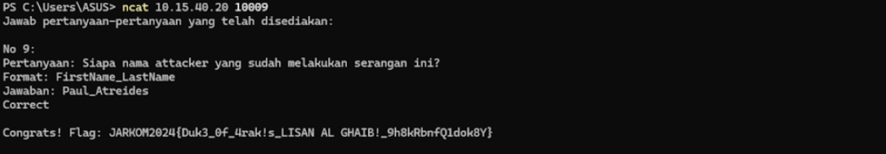

# Praktikum Jarkom Modul 1 Kelompok IT19

## Anggota kelompok
| Nama | NRP |
|------|-----|
| Hafiz Akmaldi Santosa | 5027221061 |
| Arsyad Rizantha Maulana Salim | 5027221049 |

## Write Up

1. *Creds*
   
   Pada soal ini kami diharuskan untuk menemukan kredensial dari server FTP yang dibuat oleh attacker. Disini kami menggunakan tools Wireshark.
   
   
   
   Pertama kami membuka attachment yang diberikan berupa file evidence.pcap dan melakukan pencarian dengan kata kunci FTP melalui `display filter`. Berdasarkan hasil yang didapatkan, kami melihat dari hasil yang didapatkan yang kemungkinan terdapat informasi kredensial yang digunakan untuk login. kami mencoba melakukan follow terhadap salah satu stream dan mendapatkan informasi sebagai berikut:
   
   
   
   Sehingga telah didapatkan kredensial dari server FTP yang dibuat oleh attacker:
   
   Username: `h3ngk3rTzy`
   
   Password: `S!l3ncE`
   
   Kemudian kita memasukan jawaban melalui terminal dengan `ncat 10.15.40.20 10007` untuk mendapatkan flag.

   

3. *malwleowleo*
   
   Dengan attachment yang sama dengan soal sebelumnya, kami diminta untuk menemukan file malware yang dikirim oleh attacker melalui FTP. Disini kami menggunakan tools filezilla client untuk masuk dengan kredensial attacker dan melakukan transfer file yang dikirim oleh attacker ke laptop kami.

   

   Disini kami menemukan 2 file yang dikirimkan oleh attacker yaitu `mirza.jpg` dan `m4L1c10us_W4re.c` sehingga dapat menjawab soal ini dan mendapatkan flag.

   

4. *secret*
   
   Masih dengan attachment yang sama dengan soal sebelumnya, kali ini kami diminta untuk menemukan pesan rahasia dari attacker. Disini kami mencoba membuka salah satu file yang berhasil kami transfer dari attacker yaitu `mirza.jpg`, kemudian didapatkan pesan rahasia sebagai berikut:

   

   Sehingga kami dapat memasukan jawaban dan mendapatkan flag.

   

5. *whoami*
   
   Kembali dengan attachment yang sama, kali ini kami diminta untuk menemukan siapa identitas attacker. Kami melihat ke dalam file `m4L1c10us_W4re.c` dan mendapatkan pesan comment yang di-enkripsi.

   

   Kami memasukan pesan yang ter-enkripsi tersebut ke salah satu tools yang digunakan untuk dianalisa jenis enkripsi dan melakukan decode. Kami menggunakan website `www.decode.fr` dan mendapatkan hasil sebagai berikut:

   

   Didapatkan pesan rahasia yang berhasil di decode yaitu `Hello my name is Paul Atreides`. Sehingga kami mendapatkan jawaban dan flag.

   
